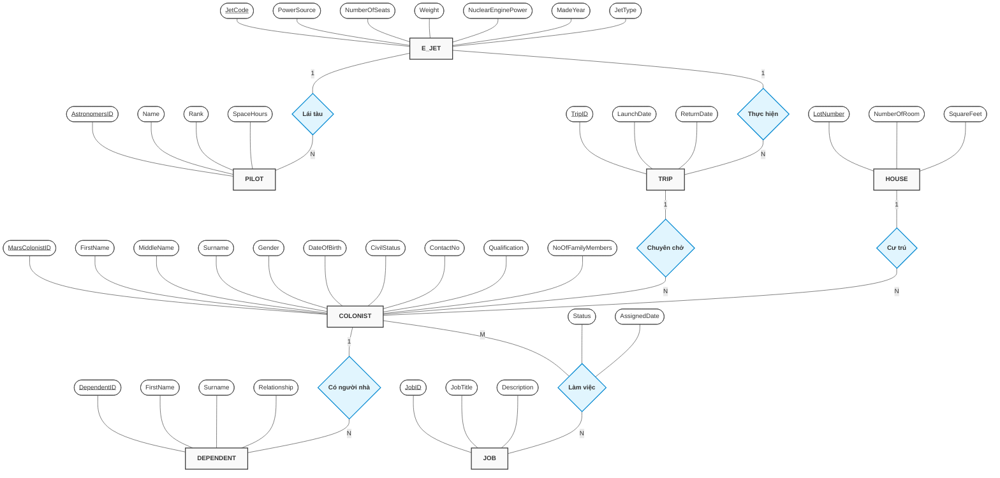

# Sơ đồ ERD - Mars Colony

Dưới đây là sơ đồ ERD Mức Khái niệm (Chen Notation) thể hiện các thực thể, thuộc tính và mối quan hệ của hệ thống quản lý định cư Sao Hỏa.

## Nhận xét độ chuẩn xác (Mọi yêu cầu)

Sơ đồ và Cấu trúc quan hệ hiện tại của bạn đã **RẤT CHUẨN** và bám sát lý thuyết cơ sở dữ liệu. Tuy nhiên, để "đúng mọi yêu cầu" và không bị giảng viên bắt lỗi khi bảo vệ, bạn nên lưu ý vài điểm nhỏ sau:

1. **Thuộc tính dẫn xuất `NoOfFamilyMembers` trong `COLONIST`**: 
   - Về mặt lý thuyết chuẩn hóa (Normalization), thuộc tính này có thể được tính bằng cách đếm (COUNT) số người trong bảng `DEPENDENT`. Tuy nhiên, trong thực tế hệ thống lớn, người ta vẫn giữ thuộc tính này để tăng tốc độ truy vấn. Khi viết báo cáo, bạn nên ghi chú rõ đây là *Thuộc tính dẫn xuất (Derived Attribute)* để giảng viên thấy bạn hiểu bài.
2. **Khóa chính của `DEPENDENT`**:
   - Nếu `DependentID` là ID tự tăng độc lập thì không sao. Nhưng nếu `DependentID` chỉ là số thứ tự (1, 2, 3) của mỗi người phụ thuộc trong gia đình đó, thì Khóa chính phải là Composite Key: `(MarsColonistID, DependentID)`.
3. **Mối quan hệ E_JET và PILOT**:
   - Hiện tại cấu trúc là 1 phi công chỉ lái 1 tàu (`JetCode` nằm trong `PILOT`). Điều này có nghĩa phi công đó được gắn chết với tàu đó. Nếu phi công có thể đổi tàu qua lại, thì mối quan hệ này phải là N-N. Nhưng theo thiết kế của bạn, 1-N đã đủ đáp ứng yêu cầu cơ bản.
